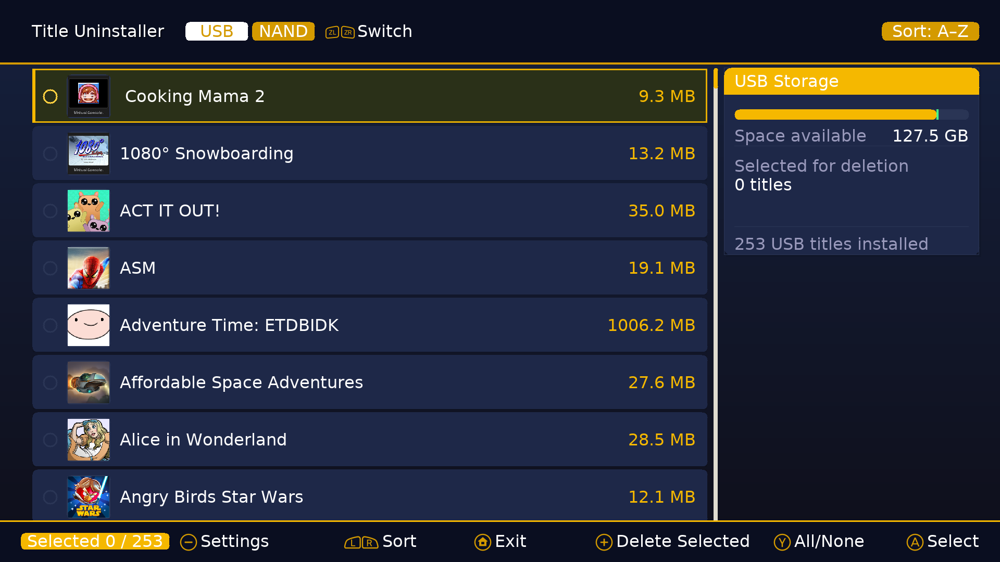
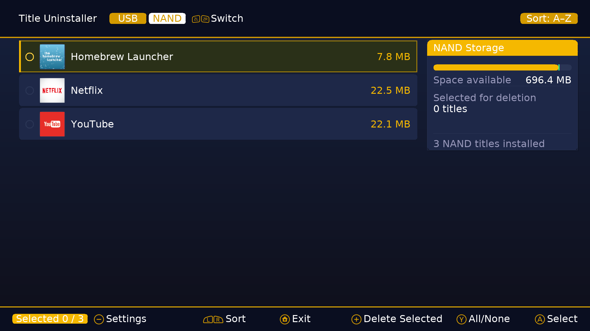
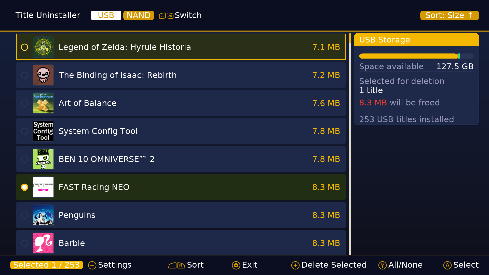
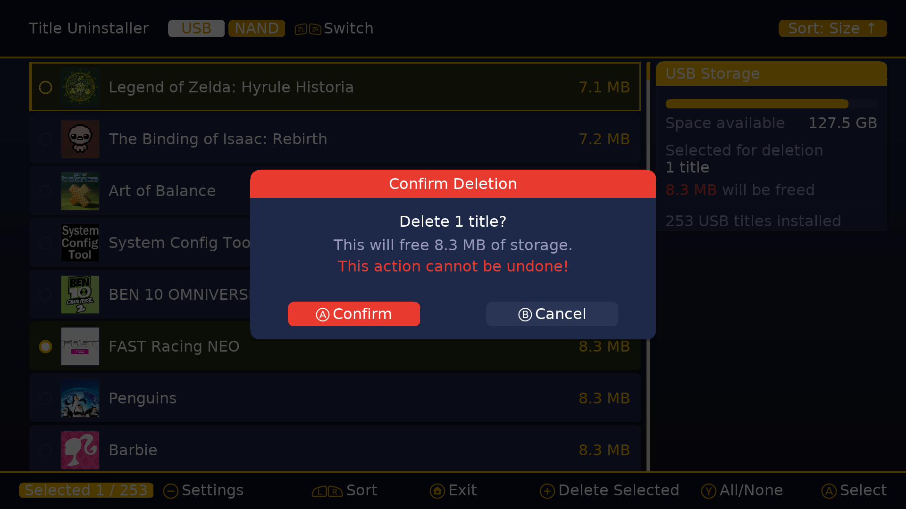

# Title Uninstaller

A batch title uninstaller for the Nintendo Wii U.

## Screenshots








---

## Installation

1. Copy `WiiUTitleUninstaller.wuhb` to `sd:/wiiu/apps/`

## Building

Requires [devkitPro](https://devkitpro.org/) with WUT and the following:

- [wiiu-sdl2](https://github.com/yawut/SDL) (wiiu-sdl2_ttf, wiiu-sdl2_image)

- [libmocha](https://github.com/wiiu-env/libmocha)

```bash
make
```

Output: `WiiUTitleUninstaller.wuhb`

---

## Credits

- Built with [devkitPro](https://devkitpro.org/) / [WUT](https://github.com/devkitPro/wut)
- Filesystem access via [libmocha](https://github.com/wiiu-env/libmocha)
- Font: [DejaVu Sans](https://dejavu-fonts.github.io/)